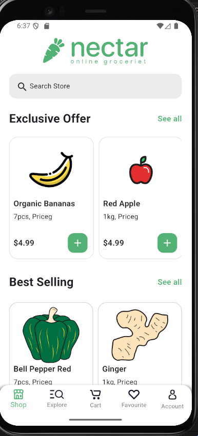
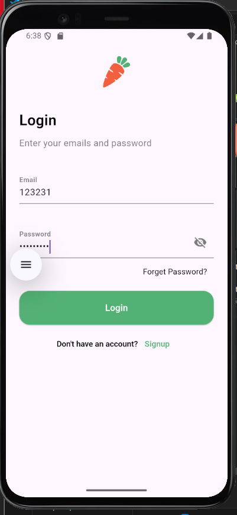
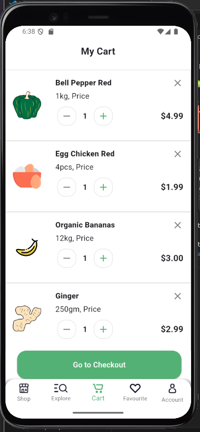
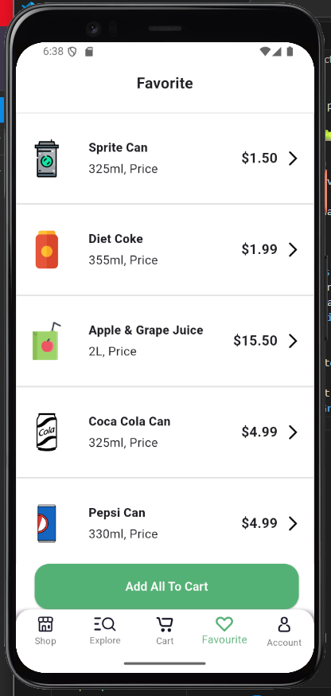
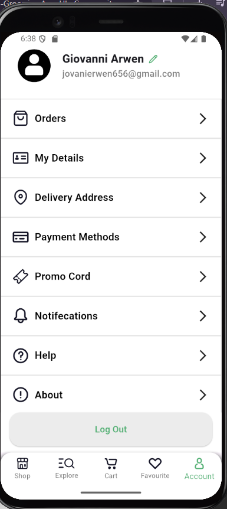
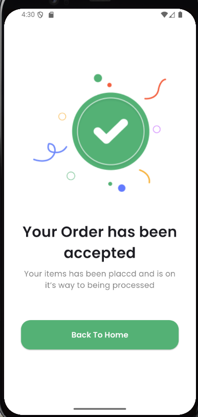
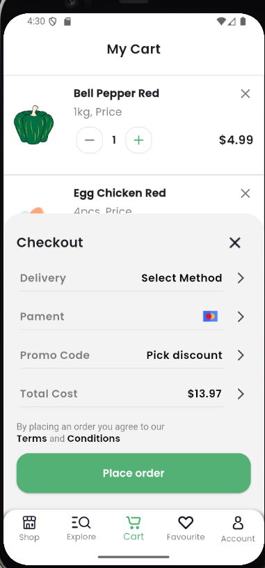
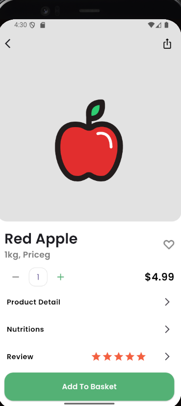

# market

A new Flutter project.

# Nectar App 🍏

**Nectar App** is a mobile store application for selling vegetables, fruits, and beverages.  
It is designed as a **UI-only** project, allowing users to browse products and navigate between pages with ease.

---

## ✨ Features
- Login with an existing account.
- Sign up for a new account.
- **Bottom Navigation Bar** for quick navigation between:
  - 🏠 Home
  - 🔍 Search
  - ❤️ Favorites
  - 🛒 Cart
  - 👤 Account
- Multiple **Grid** la

## Screenshots

## new screens

